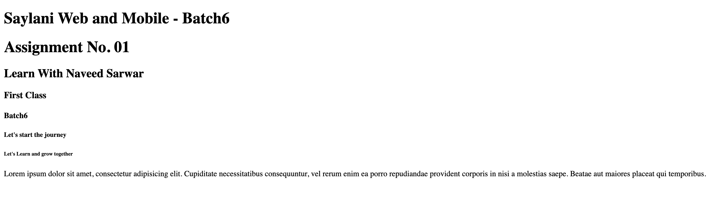

# HTML Headings and Paragraphs Assignment

Welcome to the HTML Headings and Paragraphs Assignment! This guide will help you understand the basics of creating headings and paragraphs in HTML.

## Table of Contents

1. [Introduction to HTML](#introduction-to-html)
2. [Headings](#headings)
3. [Paragraphs](#paragraphs)
4. [Assignment Instructions](#assignment-instructions)
5. [Example](#example)

## Introduction to HTML

HTML (Hypertext Markup Language) is the standard language for creating web pages. It uses elements and tags to structure and display content on the web.

## Headings

HTML headings are used to define the titles and subtitles on a web page. There are six levels of headings, from `<h1>` to `<h6>`, with `<h1>` being the most important and `<h6>` the least.

- `<h1>`: Main heading
- `<h2>`: Subheading
- `<h3>`: Sub-subheading
- `<h4>`: Sub-sub-subheading
- `<h5>`: Sub-sub-sub-subheading
- `<h6>`: Sub-sub-sub-sub-subheading

## Paragraphs

The `
` tag is used to define paragraphs of text in an HTML document. Each paragraph is a block-level element and typically contains a distinct section of text.

## Assignment Instructions

1. Create a new HTML file named `index.html`.
2. Add the basic HTML structure, including `<!DOCTYPE html>`, `<html>`, `<head>`, and `<body>` tags.
3. Inside the `<body>` tag, add the elements according to image given to you:-

## Example

Here is an example of what your `index.html` might look like:

---

Good luck with your assignment! If you have any questions, feel free to reach out.
